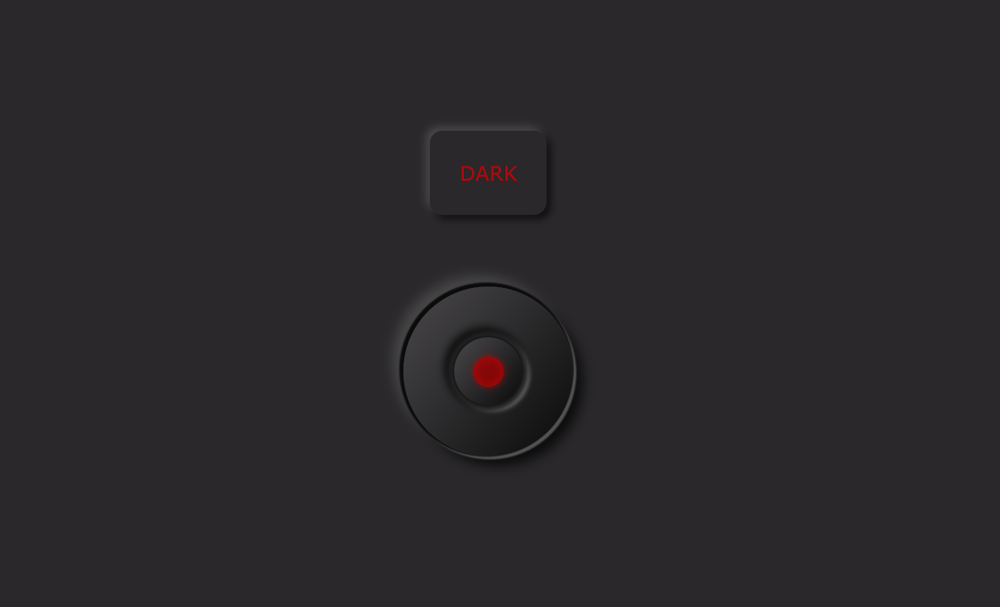
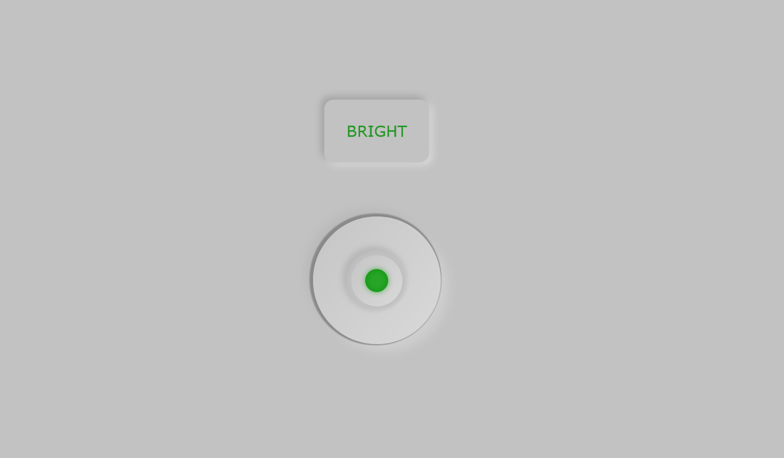

# Darkswitch Button Practice Project

Hey there! This is a practice project I've been working on. It's a simple switch that toggles between dark and bright modes.

## About

This project was written by me as a practice exercise to improve my skills. 

## Language & Tech Used

- HTML
- CSS
- JavaScript

## Preview

### Dark Mode

### Bright Mode

---
You can try it [HERE](https://sandorgyorfi.github.io/Darkswitch-Button/).

Hope you like it!
